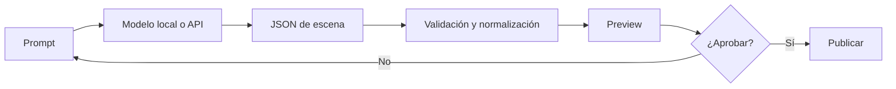

# Open Signage Plus

<p align="center">
  <strong>Digital signage, kioscos y pantallas inteligentes sin complicar la operación.</strong><br/>
  Xibo como motor. Open Signage Plus como experiencia.
</p>

<p align="center">
  
  
  
  
  
  
</p>

---

## ¿Qué es Open Signage Plus?

**Open Signage Plus** es una plataforma de señalización digital orientada a empresas que necesitan publicar contenido en televisores, pantallas, tablets, kioscos y navegadores sin obligar al usuario operativo a aprender la interfaz completa de un CMS de signage.

El proyecto utiliza **Xibo CMS como motor de signage** y agrega una capa propia mucho más simple para operar el día a día: PWA responsive, creación guiada, subida de contenido, programación, IA generativa, QR, turnos, interacción táctil y un reproductor universal basado en navegador.

> **Xibo resuelve el motor. Open Signage Plus resuelve la experiencia.**

La idea central es sencilla: conservar la madurez técnica de Xibo y presentar al usuario una interfaz propia, más moderna, directa y preparada para automatización.

---

## El problema que resuelve

Muchas soluciones de digital signage funcionan, pero terminan siendo demasiado técnicas para marketing, recepción, ventas, gerencia o personal de tienda. El resultado suele ser dependencia constante del área de TI para tareas tan simples como cambiar una promoción, publicar un video o conectar una pantalla nueva.

Open Signage Plus busca eliminar esa fricción:

- **Marketing** publica promociones sin entrar al CMS técnico.
- **Recepción** puede usar pantallas táctiles con turnos y QR.
- **Ventas** puede mostrar campañas, precios, catálogos o llamados a la acción.
- **Gerencia** puede desplegar dashboards y contenido corporativo.
- **TI** conserva control de seguridad, infraestructura, credenciales y Xibo.
- **Sucursales** pueden instalar una pantalla usando un navegador y un código corto.

---

## Funciones principales

| Área | Capacidades |
|---|---|
| **Panel PWA** | Administración responsive desde PC, tablet o móvil |
| **Motor Xibo** | Displays, layouts, biblioteca, playlists, grupos y scheduling |
| **Studio** | Creación y publicación guiada de escenas |
| **AI Studio** | Generación de escenas con IA local o API, siempre con preview antes de publicar |
| **Web Player** | Reproducción directa en navegador sin APK |
| **Pairing** | Vinculación de TV/pantalla mediante código corto de 6 caracteres |
| **Media** | Subida de imágenes, videos y archivos a Xibo Library |
| **QR** | Generación de códigos QR dentro del stack |
| **Interacción táctil** | Botones que abren URLs o generan turnos |
| **Turnos** | Emitir, listar, llamar siguiente y completar atención |
| **Offline** | Cache local del último contenido reproducible |
| **Seguridad** | Sesión administrativa firmada, secrets solo en backend y rutas protegidas |
| **Docker** | Instalación reproducible con Xibo, MySQL, XMR, Memcached, QuickChart y servicios PLUS |
| **IA local opcional** | Ollama mediante perfil Docker `ai` |

---

## Arquitectura

```mermaid
flowchart TD
    U[Usuario / Marketing / TI] --> PWA[Open Signage Plus PWA]
    PWA --> API[Open Signage API]

    API --> AUTH[Sesiones administrativas]
    API --> XIBO[Xibo CMS API]
    API --> AI[AI Gateway]
    API --> PLUS[PLUS Services]

    XIBO --> MEDIA[Media Library]
    XIBO --> LAYOUTS[Layouts / Playlists]
    XIBO --> SCHEDULE[Scheduling / Displays]

    AI --> OLLAMA[Ollama local]
    AI --> REMOTE[API compatible]

    PLUS --> SCENES[Scenes]
    PLUS --> DEVICES[Devices / Pairing]
    PLUS --> QR[QR]
    PLUS --> QUEUES[Turnos]

    SCENES --> WEBPLAYER[Browser Player]
    DEVICES --> SCREEN[/screen]
    XIBO --> XPLAYERS[Xibo Players]
```

Las credenciales OAuth de Xibo, claves de IA y secretos administrativos **no se entregan al navegador**.

---

## Dos caminos de reproducción

Open Signage Plus no obliga a escoger entre nuestro player y Xibo. Ambos pueden coexistir.

### 1. Ruta Xibo

Ideal cuando se necesita toda la semántica del ecosistema Xibo:

```text
Media
  ↓
Xibo Library
  ↓
Layout / Playlist
  ↓
Programación
  ↓
Display Group
  ↓
Xibo Player
```

### 2. Ruta PLUS Browser Player

Ideal para una instalación extremadamente simple:

```text
Studio / AI Studio
       ↓
    Escena PLUS
       ↓
      /screen
       ↓
TV · PC · Tablet · Kiosco
```

No requiere APK para la pantalla: basta un navegador moderno.

---

## Conectar una pantalla en menos pasos

En el navegador de la TV, PC o tablet:

```text
http://SERVIDOR:8080/screen
```

La pantalla obtiene un código como:

```text
AB12CD
```

Luego, desde **Studio**:

1. publica una escena;
2. escribe el código mostrado en la TV;
3. asigna un nombre, por ejemplo `Lobby Principal`;
4. pulsa **Vincular a escena publicada**.

La pantalla conserva su identidad y consulta automáticamente la escena asignada.

Para integraciones directas también está disponible:

```text
/player/<scene-token>
```

---

## AI Studio

La IA está pensada como asistente de creación, no como un proceso que publica contenido sin supervisión.



Puede trabajar con:

- **Ollama local**, sin enviar el prompt fuera del servidor.
- Un endpoint remoto compatible con Chat Completions.

La IA puede proponer texto, composición, botones, QR y acciones permitidas. Toda salida pasa por el normalizador del backend antes de convertirse en contenido reproducible.

---

## Kioscos, QR y turnos

Una pantalla PLUS puede ser interactiva.

Ejemplo: recepción de una empresa.

```text
┌───────────────────────────────────────┐
│          BIENVENIDO                   │
│                                       │
│       [ TOMAR TURNO ]                 │
│                                       │
│                     ┌──────────┐      │
│                     │    QR    │      │
│                     └──────────┘      │
└───────────────────────────────────────┘
```

Al tocar **Tomar turno**:

```text
Player
  ↓
POST /api/queues/recepcion/tickets
  ↓
R001
  ↓
Modal en pantalla
```

Desde el módulo **Turnos**, el operador puede:

- emitir manualmente;
- ver pendientes;
- llamar al siguiente;
- indicar módulo o escritorio;
- completar la atención.

Los datos se guardan de forma persistente en el volumen de Open Signage Plus.

---

## Casos de uso

### Retail y tiendas

Promociones, ofertas, nuevos productos, precios, campañas de temporada y QR hacia catálogo o compra.

### Talleres y concesionarios

Pantallas de recepción, turnos, promociones, accesorios, mantenimiento, entrega de vehículos y dashboards operativos.

### Oficinas

Comunicados, cultura corporativa, indicadores, cumpleaños, seguridad, salas de reuniones y anuncios internos.

### Clínicas y atención al cliente

Turnos, instrucciones, información de servicios, QR de formularios y pantallas táctiles.

### Restaurantes y hoteles

Menús digitales, precios, promociones, información de eventos y señalización dinámica.

### Centros educativos

Horarios, anuncios, eventos, información académica y pantallas en áreas comunes.

---

## Stack tecnológico

### Frontend

- React 19
- TypeScript
- Vite
- PWA / Service Worker
- Playwright

### Backend

- Node.js 22+
- Express 5
- REST API
- Persistencia local atómica para servicios PLUS

### Signage

- Xibo CMS 4.5.x
- XMR
- MySQL
- Memcached
- QuickChart

### IA

- Ollama opcional
- API externa compatible

### Infraestructura

- Docker Engine
- Docker Compose v2
- Nginx

---

# Instalación

## Requisitos

- Linux con Docker Engine.
- Docker Compose v2 (`docker compose`).
- Acceso a los puertos 8080 y 8081 durante configuración inicial, o reverse proxy equivalente.
- Recomendado: dominio y TLS en producción.

## Instalación estándar

```bash
git clone https://github.com/LORDMANUEL/OPEN-SINAGE-PLUS.git
cd OPEN-SINAGE-PLUS
git checkout feat/open-signage-plus-v2-xibo
chmod +x install.sh
./install.sh --admin-email=admin@empresa.com
```

El instalador automáticamente:

1. verifica Docker y Compose;
2. genera una contraseña MySQL aleatoria;
3. genera una contraseña administrativa aleatoria;
4. genera un secreto de sesión;
5. crea o migra `.env`;
6. aplica permisos `600` al archivo de secretos;
7. crea los volúmenes persistentes;
8. valida Docker Compose;
9. construye los servicios;
10. levanta el stack.

La contraseña administrativa generada se muestra al terminar. **Guárdela en un gestor de contraseñas.**

---

## Instalación con IA local

```bash
./install.sh \
  --with-ai \
  --ai-model=qwen2.5:1.5b \
  --admin-email=admin@empresa.com
```

El instalador habilita el perfil Docker `ai`, levanta Ollama y descarga el modelo solicitado.

Para un servidor pequeño puede usar una API externa y evitar el consumo local de RAM:

```env
AI_PROVIDER=compatible
AI_BASE_URL=https://proveedor.example/v1
AI_MODEL=modelo
AI_API_KEY=secreto
```

---

## Configurar Xibo

Xibo queda disponible inicialmente en:

```text
http://SERVIDOR:8081
```

Complete el wizard de Xibo y cree una aplicación OAuth tipo `client_credentials`.

Luego agregue al `.env`:

```env
XIBO_CLIENT_ID=...
XIBO_CLIENT_SECRET=...
```

Reinicie únicamente el gateway:

```bash
docker compose --env-file .env -f docker-compose.v2.yml up -d open-signage-api
```

Después abra Open Signage Plus:

```text
http://SERVIDOR:8080
```

y use:

```text
Motor Xibo → Verificar conexión
```

---

## Actualizar una instalación existente

El instalador detecta un `.env` previo y conserva sus valores. Solo agrega las nuevas claves necesarias cuando faltan.

```bash
git pull
./install.sh
```

Para habilitar posteriormente IA local:

```bash
./install.sh --with-ai --ai-model=qwen2.5:1.5b
```

---

## Seguridad

El proyecto incluye varias protecciones por defecto:

- sesión administrativa HMAC firmada con expiración;
- contraseña administrativa y secreto de sesión generados automáticamente;
- comparación de credenciales en tiempo constante;
- rutas administrativas protegidas con Bearer session;
- credenciales OAuth Xibo únicamente en backend;
- `AI_API_KEY` únicamente en backend;
- `X-Powered-By` deshabilitado;
- sanitización de mensajes de error;
- límites y timeout en uploads e integraciones;
- límite de upload alineado entre Nginx y Express;
- tokens aleatorios para escenas y dispositivos;
- HTML mostrado dentro de `iframe sandbox`;
- URLs remotas restringidas a HTTP(S);
- Content Security Policy y headers defensivos en Nginx;
- archivos persistentes escritos mediante reemplazo atómico.

### Producción

En Internet publique preferiblemente **solo Open Signage Plus mediante HTTPS**.

El puerto administrativo de Xibo, MySQL, XMR, Ollama y demás servicios internos no deberían exponerse públicamente salvo necesidad expresa y reglas de firewall específicas.

---

## Desarrollo

Frontend:

```bash
npm ci
npm run dev
```

Validación frontend:

```bash
npm run lint
npm run build
```

Backend:

```bash
cd packages/backend
npm ci
npm test
npm start
```

E2E:

```bash
npx playwright install chromium
npx playwright test --project=chromium
```

---

## CI/CD

GitHub Actions valida cuatro gates independientes:

```text
frontend
  ├─ npm ci
  ├─ lint
  └─ build

backend
  ├─ npm ci
  └─ tests

deployment
  ├─ bash -n install.sh
  ├─ docker compose config
  └─ nginx -t

e2e
  └─ Playwright Chromium
```

El workflow cancela ejecuciones obsoletas de la misma rama para validar siempre el último commit.

---

## Estructura conceptual

```text
OPEN-SINAGE-PLUS/
├── src/                    # PWA React
├── e2e/                    # pruebas Playwright
├── packages/backend/       # API y servicios PLUS
├── deploy/                 # Nginx
├── docs/                   # arquitectura y despliegue
├── public/                 # assets PWA
├── docker-compose.v2.yml   # stack completo
├── Dockerfile.web          # frontend productivo
├── install.sh              # instalador/migrador
└── README.md
```

---

## Alcance del Browser Player

El **PLUS Web Player** es el canal browser-first del proyecto y está pensado para Smart TV browser, PC, tablet, kiosco y panel táctil.

No pretende fingir ser una implementación completa de XMDS/XLF. Para funcionalidades exclusivas del ecosistema Xibo, el producto conserva la ruta Xibo y sus players oficiales. Esta separación evita duplicar innecesariamente un motor maduro y permite que cada camino se use donde aporta mayor valor.

---

## Filosofía del proyecto

Open Signage Plus busca ser:

**Simple para operar.**  
El usuario cotidiano no debería necesitar entrenamiento técnico para cambiar una campaña.

**Potente por debajo.**  
Xibo, Docker, APIs, IA y automatización siguen disponibles detrás de una experiencia más clara.

**Browser-first.**  
Una pantalla básica debe poder empezar con una URL y un código corto.

**Escalable.**  
El mismo concepto debe poder crecer desde una sola TV hasta múltiples sucursales y displays.

**Abierto a integración.**  
Dashboards, APIs, sistemas de turnos, QR y nuevos conectores pueden sumarse sin rehacer el producto.

---

## Roadmap

- Editor visual avanzado drag-and-drop.
- Conversión de escenas PLUS a composiciones Xibo enriquecidas.
- Plantillas reutilizables por industria.
- Gestión central de múltiples organizaciones/sucursales.
- Métricas de reproducción y campañas.
- Integraciones con BI, ERP, calendarios y feeds externos.
- Roles administrativos más granulares.
- Catálogo de widgets PLUS.

---

## Licencias

Open Signage Plus mantiene su aplicación separada de Xibo CMS y se comunica con este mediante API. Xibo y los contenedores o componentes de terceros conservan sus licencias correspondientes.

Antes de redistribuir comercialmente una instalación, revise las condiciones aplicables de cada dependencia incluida en el stack.

---

<p align="center">
  <strong>Open Signage Plus</strong><br/>
  Señalización digital simple por fuera. Potente por dentro.
</p>
