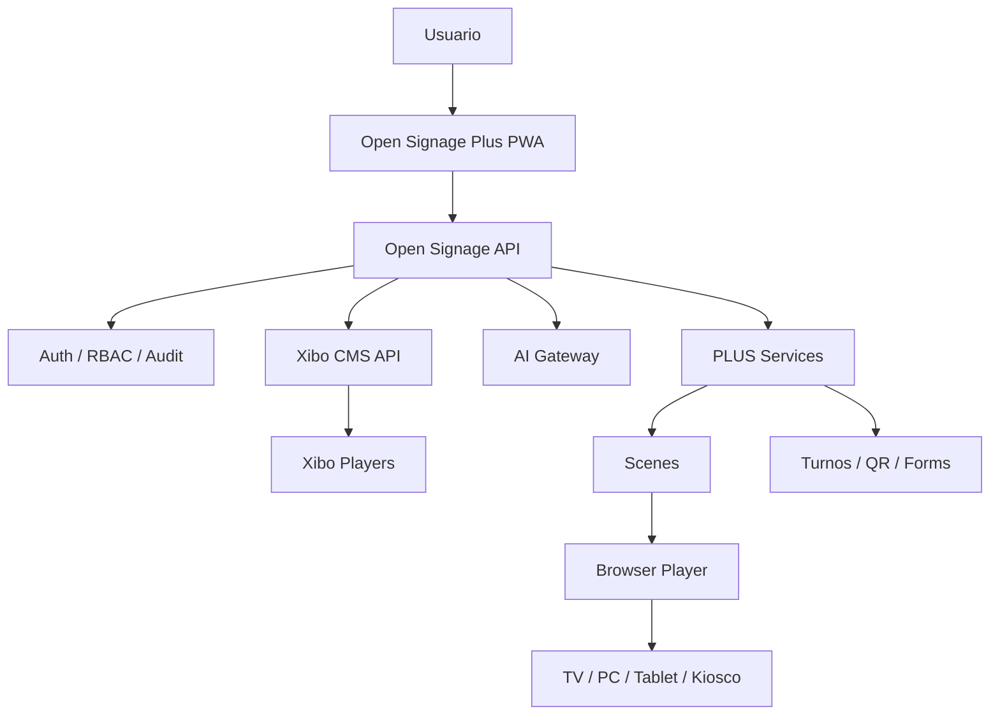

# Open Signage Plus

<p align="center">
  <strong>Digital signage, kioscos y pantallas inteligentes sobre Xibo, simplificados para operar desde cualquier navegador.</strong><br/>
  Xibo como motor. Open Signage Plus como experiencia, automatización e inteligencia.
</p>

<p align="center">
  
  
  
  
  
  
  
</p>

> **Estado:** `main` es el canal estable. `alpha` integra funciones nuevas y `beta` estabiliza candidatos. El roadmap, P0/P1/P2 y Definition of Done viven en [`MASTER.md`](MASTER.md).

## Qué es

**Open Signage Plus** es una plataforma PWA de señalización digital que usa **Xibo CMS como motor** pero evita exponer su complejidad al usuario operativo. Marketing, recepción, ventas o gerencia trabajan desde una interfaz propia; TI conserva el control de infraestructura, credenciales, seguridad y Xibo.

Funciona con dos rutas de reproducción:

```text
Open Signage Plus PWA
        │
        ├── Open Signage API ── Xibo API ── Xibo Players
        │
        └── PLUS Scenes ── Browser Player /screen
```

El Browser Player está diseñado para televisores, PC, tablets y paneles táctiles que dispongan de un navegador moderno, sin obligar a instalar APK.

## Capacidades actuales

| Módulo | Capacidades |
|---|---|
| **Núcleo** | login, sesiones firmadas, RBAC, usuarios, auditoría, settings, health |
| **Motor Xibo** | displays, layouts, library, playlists, grupos, publish y scheduling |
| **Studio** | canvas, plantillas, 16:9/9:16, capas, undo/redo, timeline y animaciones |
| **HTML Studio** | HTML + CSS, preview en `iframe sandbox`, publicación browser-first |
| **AI Studio** | Ollama/API compatible, generación, revisión, health/fallback, aprobación humana |
| **Browser Player** | pairing de 6 caracteres, heartbeat, offline last-known-good, Proof of Play |
| **Kiosco** | navegación entre escenas, Inicio/Atrás, timeout, URL/ticket/scene |
| **Turnos** | emisión, prioridad, servicios, llamada, transferencia, métricas y TTS |
| **Media** | catálogo, SHA-256, deduplicación, huérfanos, FFmpeg H.264/AAC |
| **Empresas** | organizaciones, sucursales y membresías |
| **Formularios** | diseñador, runtime público y rate limit |
| **Planning** | preview, conflictos, evento ganador, analytics/interacciones |
| **Operaciones** | fleet/system health, SMTP, webhook y alertas |
| **Lifecycle** | install, doctor, backup, verify, restore, update y rollback |

La estructura detallada está en [`docs/MODULES.md`](docs/MODULES.md).

## Arquitectura



Las credenciales OAuth de Xibo, claves de IA, SMTP y secretos administrativos permanecen en backend.

## Instalación estable

Requisitos: Linux, Docker Engine, Docker Compose v2 y Git.

```bash
git clone https://github.com/LORDMANUEL/OPEN-SINAGE-PLUS.git
cd OPEN-SINAGE-PLUS
chmod +x install.sh scripts/*.sh
./install.sh --admin-email=admin@empresa.com
```

IA local opcional:

```bash
./install.sh --with-ai --ai-model=qwen2.5:1.5b --admin-email=admin@empresa.com
```

El instalador genera secretos faltantes, crea persistencia, valida Compose, construye las imágenes y levanta el stack.

### Primer arranque de Xibo

Xibo Admin queda ligado por defecto a loopback:

```text
http://127.0.0.1:8081
```

Acceda localmente o mediante túnel SSH, complete el wizard Xibo y cree OAuth `client_credentials`. Guarde en `.env`:

```env
XIBO_CLIENT_ID=...
XIBO_CLIENT_SECRET=...
```

Luego:

```bash
docker compose --env-file .env -f docker-compose.v2.yml up -d open-signage-api
```

Open Signage Plus se publica normalmente en:

```text
http://SERVIDOR:8080
```

Para producción use dominio + HTTPS y no publique MySQL, Ollama ni Xibo Admin directamente a Internet.

## Conectar una pantalla

Abra en la TV/PC/tablet:

```text
https://signage.example.com/screen
```

La pantalla muestra un código de seis caracteres. Desde Studio se vincula el código a una escena publicada; el dispositivo conserva identidad, heartbeat y contenido last-known-good.

También existe acceso directo:

```text
/player/<scene-token>
```

## Seguridad

La base actual incluye:

- sesiones firmadas y expirables;
- RBAC real en backend;
- CORS deny-by-default;
- trust proxy restringido;
- rate limits;
- CSP/headers de Nginx;
- secretos server-side;
- HTML dentro de `iframe sandbox`;
- URLs remotas limitadas a HTTP(S);
- uploads con límites/timeouts;
- persistencia con escrituras controladas;
- auditoría administrativa.

Los pendientes de hardening están enumerados en `MASTER.md`; entre ellos branch protection, SAST/secret/container scanning, threat model y pruebas cross-tenant.

## Release engineering: 5 Alpha → 1 Beta → 3 Beta → Stable

Open Signage Plus usa tres canales permanentes:

```text
feature/*
   ↓
 alpha
   ├─ vX.Y.Z-alpha.1
   ├─ vX.Y.Z-alpha.2
   ├─ vX.Y.Z-alpha.3
   ├─ vX.Y.Z-alpha.4
   └─ vX.Y.Z-alpha.5
             ↓
            beta
             ├─ vX.Y.Z-beta.1
             ├─ vX.Y.Z-beta.2
             └─ vX.Y.Z-beta.3
                        ↓
                 release/vX.Y.Z
                        ↓
                       main
                        ↓
                      vX.Y.Z
```

Reglas:

- los contadores salen de tags Git, no de conteo manual;
- no se permite saltar un número alpha/beta;
- un prerelease rojo no habilita promoción;
- `alpha.5` abre el candidato hacia `beta`;
- `beta.3` prepara automáticamente el PR estable, sincroniza package/lock y abre el siguiente ciclo;
- Stable crea tag SemVer y GitHub Release;
- hotfix sale de `main` y después se propaga a `beta`/`alpha`.

Operación completa: [`docs/RELEASES.md`](docs/RELEASES.md).

## CI por canal

**Alpha** ejecuta:

```text
release-policy + frontend + backend + E2E
```

**Beta / Stable** añaden:

```text
deployment + Compose + Nginx + imágenes Docker + FFmpeg + API smoke
```

Una promoción comprueba los checks del SHA antes de crear tags o PRs.

## Operación

```bash
./scripts/doctor.sh
./scripts/backup.sh
./scripts/verify-backup.sh shared/backups/<backup>.tar.gz
./scripts/restore.sh shared/backups/<backup>.tar.gz
./scripts/update.sh
```

Manual de operación y contingencias: [`docs/OPERATIONS.md`](docs/OPERATIONS.md).

## Desarrollo

```bash
npm ci
npm run lint
npm run build
npx playwright test --project=chromium

cd packages/backend
npm ci
npm test
```

El motor de releases tiene además tests Node independientes para política, CLI, configuración y sincronización del lockfile.

## Estructura

```text
OPEN-SINAGE-PLUS/
├── src/                       # PWA React
├── packages/backend/          # API PLUS
├── e2e/                       # Playwright
├── tests/                     # release policy tests
├── scripts/release/           # release engine
├── deploy/                    # Nginx
├── docs/                      # módulos, releases, operación
├── release.config.json        # estable/siguiente versión y umbrales
├── docker-compose.v2.yml
├── Dockerfile.web
├── install.sh
├── MASTER.md
└── README.md
```

## Producción

La V2 tiene una base funcional y CI amplio, pero **Production Ready** significa cumplir el Definition of Done completo de `MASTER.md`: instalación limpia con HTTPS, Xibo OAuth, backup/restore/upgrade probados, security gates, aislamiento tenant y certificación física mínima del Browser Player.

## Documentación clave

- [`MASTER.md`](MASTER.md) — backlog y orden maestro.
- [`docs/MODULES.md`](docs/MODULES.md) — límites y responsabilidades.
- [`docs/RELEASES.md`](docs/RELEASES.md) — Alpha/Beta/Stable.
- [`docs/OPERATIONS.md`](docs/OPERATIONS.md) — instalación, diagnóstico y contingencias.
- [`docs/RELEASE-V2.md`](docs/RELEASE-V2.md) — gate de la V2 base.

---

**Open Signage Plus**: Xibo como motor; una experiencia browser-first propia para crear, automatizar, publicar, medir e interactuar.
