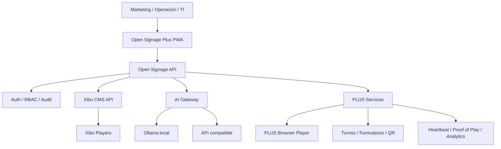

# Open Signage Plus

<p align="center">
  <strong>Digital signage, kioscos y pantallas inteligentes sobre Xibo, simplificados para operar desde cualquier navegador.</strong><br/>
  Xibo como motor. Open Signage Plus como experiencia, automatización e inteligencia.
</p>

<p align="center">
  
  
  
  
  
  
  
</p>

> **Estado:** `main` contiene la línea estable actual. El trabajo pendiente, las deudas técnicas, los gates de producción y el orden de ejecución están centralizados en [`MASTER.md`](MASTER.md).

## Visión

Open Signage Plus convierte Xibo en una plataforma más simple para marketing, recepción, ventas, gerencia y operaciones. El usuario final no necesita aprender la interfaz técnica de Xibo: utiliza una PWA propia para crear, programar, publicar, monitorear e interactuar con contenido.

La plataforma mantiene dos rutas de reproducción:

- **Xibo Players**, para aprovechar el ecosistema y scheduling de Xibo.
- **PLUS Browser Player**, para TV, PC, tablet, kiosco o panel táctil usando solo navegador, pairing y cache offline.

## Lo que ya incluye la versión estable

| Módulo | Capacidades principales |
|---|---|
| Núcleo | Login, sesiones, RBAC, usuarios, auditoría, settings y health |
| Motor Xibo | Displays, layouts, playlists, display groups, media, publicación y scheduling por API |
| Studio | Canvas visual, plantillas, 16:9/9:16, capas, drag, undo/redo, timeline y animaciones |
| HTML Studio | HTML + CSS, preview aislado, animaciones CSS y publicación browser-first |
| AI Studio | Ollama o API compatible, generación/revisión, health, fallback y aprobación explícita |
| Browser Player | `/player/<token>`, `/screen`, pairing, heartbeat, last-known-good y Proof of Play |
| Kiosco | Navegación táctil, Inicio/Atrás, timeout de inactividad y acciones controladas |
| Turnos | Emisión, prioridad, servicio, llamada, transferencia, métricas y TTS local |
| Media | Biblioteca, SHA-256, deduplicación, huérfanos y FFmpeg H.264/AAC |
| Empresas | Organizaciones, sucursales y membresías |
| Formularios | Diseñador, `/form/<id>`, respuestas públicas limitadas y rate-limit |
| Planning | Preview de programación, conflictos, evento ganador, analytics e interacciones |
| Operaciones | Fleet health, system health, SMTP/webhook, alertas y auditoría |
| Lifecycle | Instalación, doctor, backup, verificación, restore, update y rollback |
| Seguridad | RBAC backend, rate limits, CSP, secretos server-side, CORS y HTML sandboxed |
| CI | frontend, backend, deployment y Playwright E2E sobre la misma cabeza |

La definición técnica de cada módulo está en [`docs/MODULES.md`](docs/MODULES.md) y la operación diaria en [`docs/OPERATIONS.md`](docs/OPERATIONS.md).

## Arquitectura



Las credenciales OAuth de Xibo, claves de IA y secretos administrativos permanecen en backend.

## Creación de contenido

### Studio visual

Permite construir escenas con texto, imágenes, QR y composición por capas, aplicar plantillas, cambiar entre horizontal y vertical y controlar entrada/salida de elementos mediante timeline.

### HTML Studio

Permite crear anuncios y widgets con HTML + CSS. El preview y el player usan `iframe sandbox` sin permisos de script. Para contenido dinámico se prefieren APIs y módulos PLUS controlados, no JavaScript arbitrario dentro del panel.

### AI Studio

```text
Prompt → proveedor local/remoto → escena estructurada → normalización → preview → aprobación → publicación
```

La IA no publica automáticamente por defecto.

## Pantallas sin APK

En la pantalla abra:

```text
http://SERVIDOR:8080/screen
```

El dispositivo recibe un código corto. Desde Studio se vincula ese código a una escena y el navegador conserva identidad, heartbeat y contenido last-known-good.

También puede reproducirse una escena directamente:

```text
/player/<scene-token>
```

## Instalación estable

### Requisitos

- Linux recomendado para producción.
- Docker Engine.
- Docker Compose v2.
- Git.
- Dominio + HTTPS recomendado para Internet.

### Instalación estándar desde `main`

```bash
git clone https://github.com/LORDMANUEL/OPEN-SINAGE-PLUS.git
cd OPEN-SINAGE-PLUS
chmod +x install.sh scripts/*.sh
./install.sh --admin-email=admin@empresa.com
```

No se requiere hacer checkout de una rama feature para instalar la versión estable.

### IA local opcional

```bash
./install.sh --with-ai --ai-model=qwen2.5:1.5b --admin-email=admin@empresa.com
```

En VPS con poca RAM es preferible configurar un proveedor remoto compatible y no levantar Ollama.

## Configuración inicial de Xibo

El contenedor Xibo Admin queda ligado por defecto a loopback:

```text
127.0.0.1:8081
```

Para administrarlo desde otra máquina use una red administrativa, túnel SSH o cambie deliberadamente `XIBO_ADMIN_BIND`; no se recomienda exponer Xibo Admin directamente a Internet.

Después del wizard Xibo cree OAuth `client_credentials` y configure:

```env
XIBO_CLIENT_ID=...
XIBO_CLIENT_SECRET=...
```

Luego reinicie el gateway:

```bash
docker compose --env-file .env -f docker-compose.v2.yml up -d open-signage-api
```

Open Signage Plus queda en:

```text
http://SERVIDOR:8080
```

## Operación y recuperación

Diagnóstico:

```bash
./scripts/doctor.sh
```

Backup:

```bash
./scripts/backup.sh
```

Verificación:

```bash
./scripts/verify-backup.sh shared/backups/open-signage-plus-YYYYMMDDTHHMMSSZ.tar.gz
```

Restore:

```bash
./scripts/restore.sh shared/backups/open-signage-plus-YYYYMMDDTHHMMSSZ.tar.gz
```

Update seguro:

```bash
./scripts/update.sh
```

El manual completo está en [`docs/OPERATIONS.md`](docs/OPERATIONS.md).

## Seguridad actual

La versión estable ya aplica sesiones firmadas y expirables, RBAC en backend, secretos Xibo/IA server-side, rate limiting en superficies públicas sensibles, CORS deny-by-default, trust proxy restringido, CSP/headers Nginx, uploads limitados, URLs remotas HTTP(S), tokens aleatorios, auditoría y HTML dentro de iframe sandbox.

Para producción se debe publicar la PWA por HTTPS y mantener MySQL, Ollama y Xibo Admin fuera de Internet salvo necesidad explícita.

## CI y criterio de release

Una cabeza no se considera liberable si no pasan los cuatro gates:

```text
frontend   → npm audit + lint + TypeScript/Vite build
backend    → runtime audit + tests
 deployment → scripts + Compose + Nginx + imágenes + FFmpeg + API smoke
e2e        → Playwright Chromium
```

## Política de versiones

La línea estable vive en `main`. El siguiente paso de productización formaliza dos canales permanentes:

```text
feature/* → alpha → beta → main
```

Regla acordada:

- 5 alphas verdes habilitan 1 beta.
- 3 betas verdes habilitan 1 estable.
- El contador nunca reemplaza los gates: una versión roja no se promueve.
- `main` recibe solo versiones estables y hotfixes certificados.

La implementación y checklist de esta política está en [`MASTER.md`](MASTER.md).

## Desarrollo

```bash
npm ci
npm run lint
npm run build

cd packages/backend
npm ci
npm test
```

E2E:

```bash
npx playwright test --project=chromium
```

## Documentación

- [`MASTER.md`](MASTER.md): fuente maestra de estado, faltantes y ruta a producción.
- [`docs/MODULES.md`](docs/MODULES.md): responsabilidades y contratos por módulo.
- [`docs/OPERATIONS.md`](docs/OPERATIONS.md): instalación, backup, restore, update y contingencias.
- [`docs/PLAYER-WEB-V2.md`](docs/PLAYER-WEB-V2.md): player browser-first.
- [`docs/RELEASE-V2.md`](docs/RELEASE-V2.md): gate de la release V2.

## Alcance y próximos pasos

La versión actual es una base funcional certificada por CI, pero **no se declara producción final para todos los clientes únicamente por existir en `main`**. La matriz de pendientes de productización —incluyendo pruebas físicas, limpieza del repositorio, release engineering, escalabilidad, observabilidad y hardening restante— está en `MASTER.md` y debe cerrarse por prioridad antes de declarar una instalación comercial completamente certificada.

---

**Open Signage Plus** — signage, kioscos, turnos, IA y experiencias interactivas sobre una plataforma browser-first, manteniendo Xibo como motor de señalización.